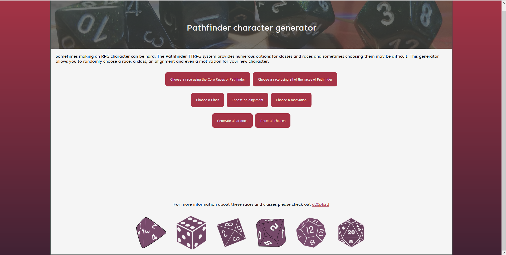
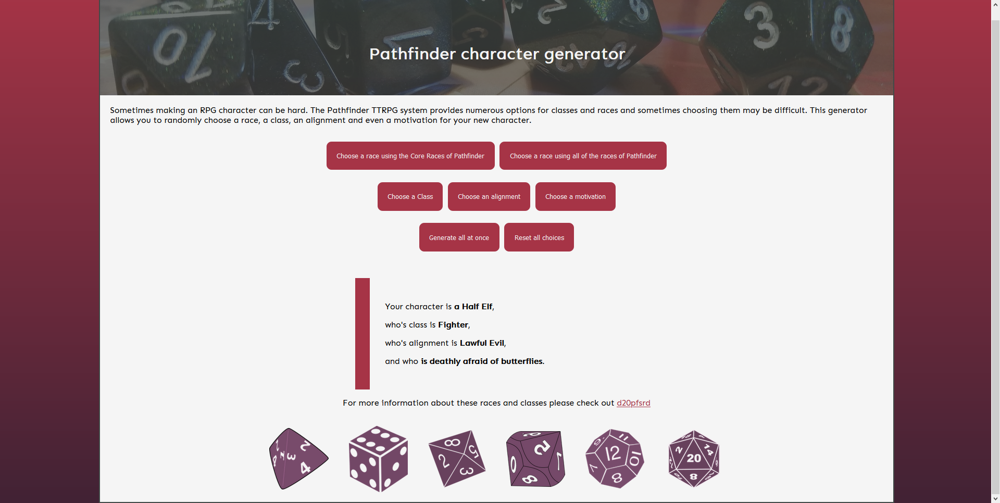

# Character Generator
A character generator for the Pathfinder tabletop RPG. With this generator a user can generate themselves a randomized character including a race, a class, an alignment and a motivation that drives the character. A user can randomize just one of these characteristics at a time or do all at once. The UI is also optimized for mobile.

The page before generating anything.

The page with a character generated.

The page rescaled to a narrow window.

The page was created as an assignment for HAMK's Basics of Web development course in the spring on 2020.
